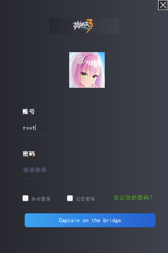
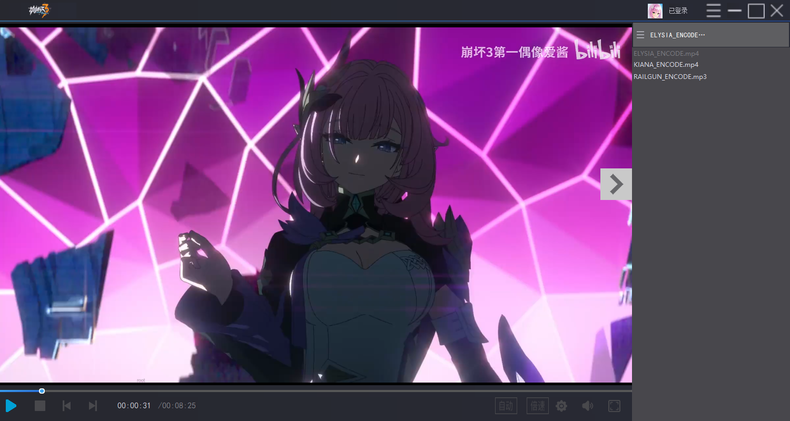
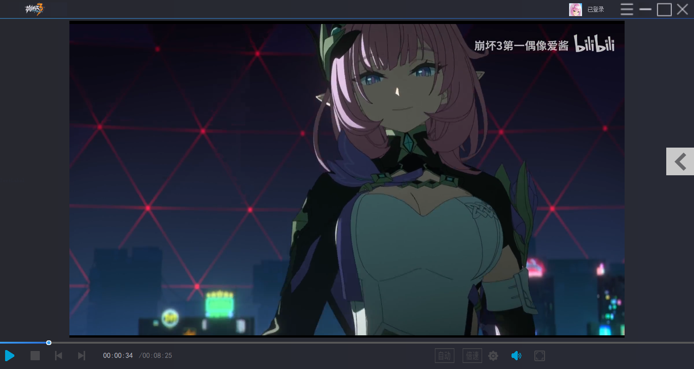
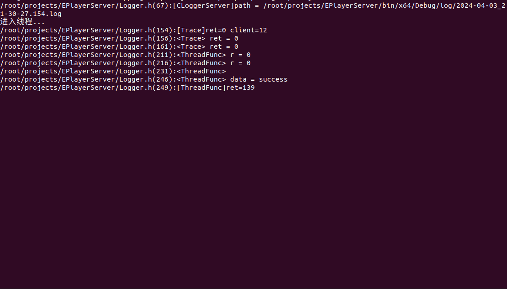
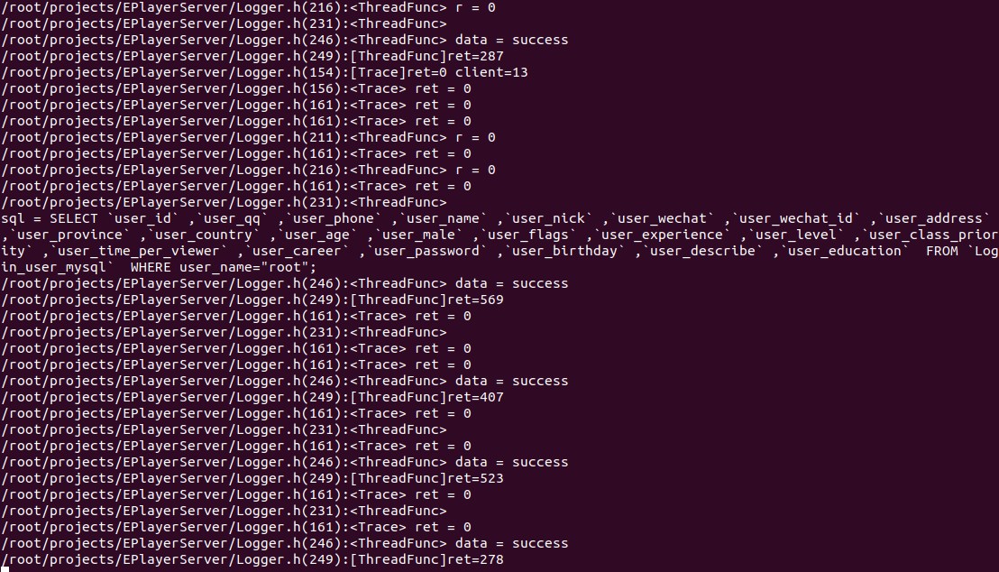

# CryptoPlayerServer
## 项目简介

本项目是基于CS架构实现的，客户端使用Windows下的Qt采用MVC结构实现，通过对VLC库进行封装实现对视频播放的控制，使用HTTP+SSL进行登录验证，获取播放密钥。服务端基于Linux环境下多进程/多线程模型，负责验证客户端连接和分发密钥功能，并且具有独立的日志模块。

### 项目使用主要技术

语言和平台：`C++`、`Windows`(客户端)、`Linux`(服务端)

客户端：`Qt`、`HTTP`、`JSON`、`VLC`、`OpenSSL`

服务端：`epoll`、`socket`、`Template`、`http_parser`、`MySQL`

## 部署和使用方法

客户端：`Qt 5.15.2 MSCV2019 32bit`

服务端：`visual studio 2022`、`Ubuntu 20.04`

## 运行效果

[登录]

[视频播放展示 1]

[视频播放展示 2]

[服务器启动]

[客户端连接]

